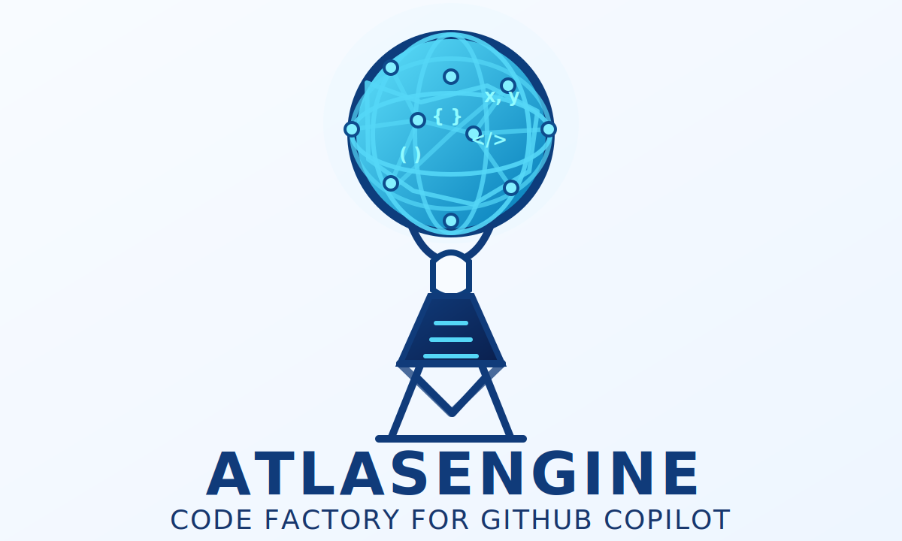
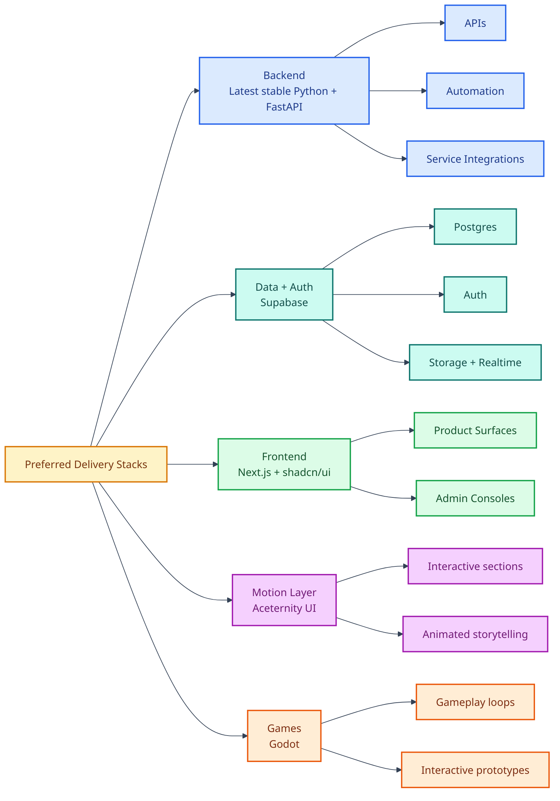
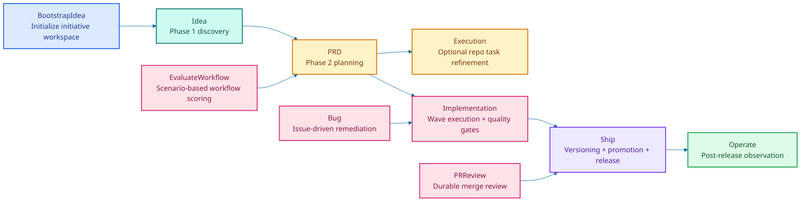
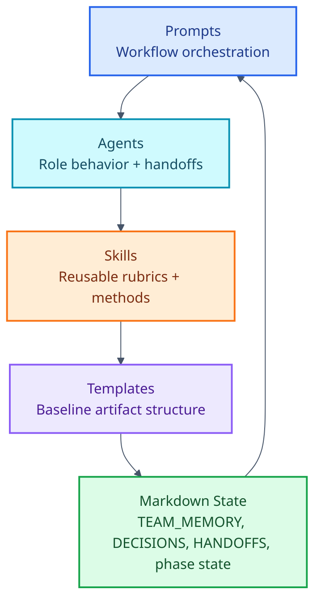
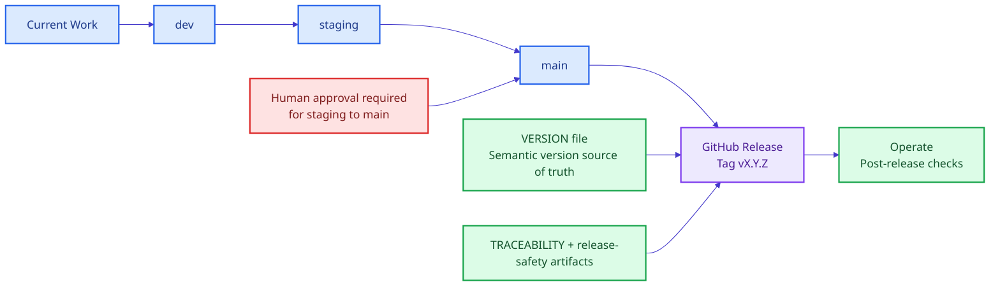

# AtlasEngine

<p align="center">
  
</p>

<p align="center">
  <a href="ai_docs/WORKFLOW.md"></a>
  <a href="VERSION"></a>
  <a href=".github/prompts"></a>
  <a href=".github/agents"></a>
  <a href=".github/skills"></a>
  <a href="ai_docs/templates"></a>
</p>

AtlasEngine is a documentation-first workflow factory for GitHub Copilot. It packages reusable prompts, specialist agents, skills, templates, and durable markdown state so product discovery, planning, implementation, review, shipping, operations, and workflow evaluation can be run with consistent gates and resumable handoffs.

## Preferred Tech Stacks

<p>
  
  
  
  
  
  
  
</p>

When implementation work is being planned or executed, the default stack preferences are:

- Python on the latest stable release with FastAPI for backend and service work.
- Supabase for database, authentication, and managed backend primitives.
- Next.js for web applications, with `shadcn/ui` as the primary component layer.
- Aceternity UI for richer interactive components, motion, and presentation-heavy sections.
- Godot for game-oriented experiences and interactive gameplay projects.



## What This Repository Is

- A structured operating model for AI-assisted product and delivery workflows.
- A prompt-and-agent system that persists state in markdown artifacts instead of chat history.
- A repo that treats review, testing, release safety, and handoff quality as first-class outputs.

## What This Repository Is Not

- An application codebase with a build, test, or runtime surface.
- A one-shot prompt collection with no state continuity.
- A workflow that collapses discovery, planning, implementation, and shipping into a single step.

## Workflow At A Glance



The authoritative workflow guide lives in [ai_docs/WORKFLOW.md](ai_docs/WORKFLOW.md). Initiative work is stored under [ai_docs/ideas](ai_docs/ideas), bug remediation under `ai_docs/bugs/<bug-run-slug>/`, review runs under `ai_docs/reviews/<pr-review-slug>/`, and evaluation runs under [ai_docs/evals](ai_docs/evals).

## Operating Model



The design intent is simple:

- Prompts own phase control flow.
- Agents own specialist behavior and explicit handoffs.
- Skills keep repeatable logic out of prompt prose.
- Templates provide artifact skeletons without duplicating rubric logic.
- Durable markdown files allow work to resume safely after interruptions or role changes.

## Durable State System

Each initiative keeps durable memory in `ai_docs/ideas/<initiative-slug>/`.

Core shared files:

- `TEAM_MEMORY.md` for facts, assumptions, risks, and unresolved questions.
- `DECISIONS.md` for durable rationale and tradeoffs.
- `AGENT_HANDOFFS.md` for owner transitions, blockers, and next actions.
- `PHASE1_STATE.md` and `PHASE2_STATE.md` for source-of-truth workflow status.

Key rule: if downstream work finds a contradiction, the upstream phase is reopened and the shared memory must be updated instead of silently continuing.

## Prompt Catalog

| Prompt | Primary Role | Purpose | Key Outputs |
| --- | --- | --- | --- |
| `/BootstrapIdea` | `agent` | Create or normalize a deterministic initiative workspace | `PHASE1_STATE.md`, `TEAM_MEMORY.md`, `INTERVIEW.md`, ideas index entry |
| `/Idea` | `idea-discovery` | Run phase-1 discovery and prepare planning handoff | `INTERVIEW.md`, shared phase-1 memory |
| `/PRD` | `product-manager-orchestrator` | Run phase-2 planning with research, PRD loops, security, UX, UI, testing, and plan output | `PRD.md`, `PLAN.md`, `TRACEABILITY.md`, release-safety artifacts |
| `/Implementation` | `project-manager` | Execute wave-based engineering work with test and E2E loops | `TASKS.md`, `IMPLEMENTATION_STATE.md`, `TEST_REPORT.md`, `E2E_REPORT.md`, `RETRO.md` |
| `/Execution` | `senior-engineer` | Optional repo-specific task refinement for implementation work | `EXECUTION_TASKS.md` |
| `/Ship` | `github-devops-engineer` | Drive semantic versioning, branch promotion, release prep, and operate handoff | `SHIP_REPORT.md`, `RELEASE_NOTES.md`, `POST_RELEASE_CHECKS.md` |
| `/Operate` | `operations-analyst` | Capture production state and close the loop into future planning | `OPERATIONS_REPORT.md`, `OUTCOME_REVIEW.md` |
| `/Bug` | `project-manager` | Run GitHub issue-driven remediation with the same quality discipline as implementation | `BUG_STATE.md`, `BUG_INTAKE.md`, `BUG_FIX_REPORT.md` |
| `/PRReview` | `pr-reviewer` | Create a durable merge review with findings and recommendation | `PR_REVIEW_STATE.md`, `PR_REVIEW_REPORT.md` |
| `/DevOpsAudit` | `github-devops-engineer` | Audit GitHub branch protections, PR controls, CI/CD, and release hardening | `ai_docs/DEVOPS_DEFICIENCIES.md` |
| `/EvaluateWorkflow` | `workflow-evaluator` | Score the workflow system against reusable scenarios | `EVAL_PLAN.md`, `CASE_<slug>.md`, `EVAL_REPORT.md` |

## Specialist Layers

Representative specialists include:

- Product and planning: `product-manager-orchestrator`, `prd-writer`, `product-researcher`, `scrum-master`, `data-metrics-analyst`
- Engineering and validation: `developer`, `senior-engineer`, `solution-architect`, `test-engineer`, `qa-strategist`, `e2e-tester`
- Risk and release: `security-reviewer`, `platform-release-engineer`, `release-manager`, `github-devops-engineer`, `operations-analyst`

Reusable skills include:

- `initiative-state-manager`
- `prd-review-loop-rubric`
- `release-safety-pack`
- `supabase-migration-discipline`
- `github-hardening-branch-airgap`
- `quality-gates-executor`
- `threat-modeling-and-security-triage`
- `traceability-maintainer`
- `browser-validation-strategy`
- `workflow-evaluation-rubric`
- `handoff-composer`

## Supabase Assets

Repository-level Supabase conventions live in [ai_docs/SUPABASE.md](ai_docs/SUPABASE.md). A starter `supabase/` scaffold is included for migration history, functions, tests, and seed data, and `.github/workflows/supabase-*.yml` provides a minimal CI/CD pattern for pull-request validation plus staged `db push` promotion.

## Shipping And Release Flow



Versioning and release policy are defined in [ai_docs/VERSIONING.md](ai_docs/VERSIONING.md), with the current version stored in [VERSION](VERSION) and release categorization in [.github/release.yml](.github/release.yml).

## Repository Map

| Path | Role |
| --- | --- |
| [.github/prompts](.github/prompts) | Workflow entry points and orchestration rules |
| [.github/agents](.github/agents) | Specialist role definitions, tools, and handoffs |
| [.github/skills](.github/skills) | Reusable rubrics, checklists, and methods |
| [ai_docs/templates](ai_docs/templates) | Artifact skeletons for initiative, bug, review, release, and eval workflows |
| [ai_docs/ideas](ai_docs/ideas) | Durable initiative workspaces and active-state index |
| [ai_docs/evals](ai_docs/evals) | Reusable evaluation cases and per-run reports |
| [.github/pull_request_template.md](.github/pull_request_template.md) | PR framing, validation, and release impact checklist |

## Install AtlasEngine In Another Repository

AtlasEngine is meant to be copied into a target repository as repo-local Copilot customization, not consumed as a package dependency. Clone this repository, copy the workflow assets you need, then adapt the repo-specific instructions before asking Copilot to use the workflow.

### Core Assets To Copy

| Path | Required | Purpose |
| --- | --- | --- |
| `.github/copilot-instructions.md` | Yes | Repository-specific operating instructions that tell Copilot how to use the workflow in the target repo |
| `.github/prompts/` | Yes | Entry-point prompts such as `/BootstrapIdea`, `/PRD`, `/Implementation`, `/Ship`, and `/Bug` |
| `.github/agents/` | Yes | Specialist agents used by the prompts |
| `.github/skills/` | Yes | Reusable rubrics and methods referenced by prompts and agents |
| `ai_docs/WORKFLOW.md` | Yes | Human-readable workflow guide and phase rules |
| `ai_docs/VERSIONING.md` | Yes | Versioning and release policy used by shipping workflows |
| `ai_docs/templates/` | Yes | Durable markdown templates used to initialize initiative, bug, review, and release artifacts |
| `ai_docs/ideas/INDEX.md` | Yes | Starting index for initiative tracking |
| `ai_docs/evals/README.md` | Recommended | Eval workflow overview |
| `ai_docs/evals/cases/` | Recommended | Reusable evaluation scenarios for `/EvaluateWorkflow` |
| `.github/pull_request_template.md` | Recommended | PR checklist aligned with the workflow |
| `.github/release.yml` | Recommended | Release categorization used during shipping |
| `VERSION` | Recommended | Semantic version source of truth |
| `ai_docs/SUPABASE.md` | Optional | Supabase-specific conventions for repos that use Supabase |
| `supabase/` | Optional | Starter Supabase structure for migrations, functions, tests, and seed data |
| `.github/workflows/supabase-migration-check.yml` | Optional | Pull request migration validation for Supabase repos |
| `.github/workflows/supabase-staging.yml` | Optional | Staging database promotion workflow for Supabase repos |
| `.github/workflows/supabase-production.yml` | Optional | Production database promotion workflow for Supabase repos |

### New Repository Setup

1. Clone AtlasEngine and clone or create the target repository locally.

  ```powershell
  git clone <atlasengine-repo-url> AtlasEngine
  git clone <target-repo-url> <target-repo>
  ```

2. Copy the required assets from AtlasEngine into the target repository. Start with the core assets table above, then add the optional Supabase and release assets if the target repo needs them.

   PowerShell example:

   ```powershell
   $source = "C:\work\AtlasEngine"
   $target = "C:\work\target-repo"

   Copy-Item "$source\.github\copilot-instructions.md" "$target\.github\copilot-instructions.md" -Force
   Copy-Item "$source\.github\prompts" "$target\.github" -Recurse -Force
   Copy-Item "$source\.github\agents" "$target\.github" -Recurse -Force
   Copy-Item "$source\.github\skills" "$target\.github" -Recurse -Force
   Copy-Item "$source\ai_docs\WORKFLOW.md" "$target\ai_docs\WORKFLOW.md" -Force
   Copy-Item "$source\ai_docs\VERSIONING.md" "$target\ai_docs\VERSIONING.md" -Force
   Copy-Item "$source\ai_docs\templates" "$target\ai_docs" -Recurse -Force
   Copy-Item "$source\ai_docs\ideas\INDEX.md" "$target\ai_docs\ideas\INDEX.md" -Force
   ```

   Bash example:

   ```bash
   source_repo="$HOME/work/AtlasEngine"
   target_repo="$HOME/work/target-repo"

   mkdir -p "$target_repo/.github" "$target_repo/ai_docs/ideas"
   cp "$source_repo/.github/copilot-instructions.md" "$target_repo/.github/copilot-instructions.md"
   cp -R "$source_repo/.github/prompts" "$target_repo/.github/"
   cp -R "$source_repo/.github/agents" "$target_repo/.github/"
   cp -R "$source_repo/.github/skills" "$target_repo/.github/"
   cp "$source_repo/ai_docs/WORKFLOW.md" "$target_repo/ai_docs/WORKFLOW.md"
   cp "$source_repo/ai_docs/VERSIONING.md" "$target_repo/ai_docs/VERSIONING.md"
   cp -R "$source_repo/ai_docs/templates" "$target_repo/ai_docs/"
   cp "$source_repo/ai_docs/ideas/INDEX.md" "$target_repo/ai_docs/ideas/INDEX.md"
   ```

3. Open the target repository in VS Code and update `.github/copilot-instructions.md` so it reflects the target repo's actual build, test, runtime, architecture, naming, and deployment rules. AtlasEngine itself is documentation-first, so a real application repo should add its real commands and constraints here.

4. If the target repo already has release automation, PR templates, or environment promotion workflows, keep the stronger existing controls and merge AtlasEngine's workflow expectations into them instead of replacing working automation without review.

5. Commit the imported customization files, then start with `/BootstrapIdea` to initialize the first initiative folder under `ai_docs/ideas/<initiative-slug>/`.

### Established Project Installation

For an existing product repository, treat AtlasEngine as a workflow layer that must be merged with current repo conventions rather than dropped in wholesale.

1. Review the target repo's existing `.github/`, docs, CI workflows, and engineering instructions before copying anything.

2. Merge or add the AtlasEngine assets in this order:
  - Add `.github/prompts/`, `.github/agents/`, `.github/skills/`, and `ai_docs/templates/`.
  - Merge `.github/copilot-instructions.md` with the repo's existing guidance instead of overwriting local build, test, architecture, or security rules.
  - Add `ai_docs/WORKFLOW.md`, `ai_docs/VERSIONING.md`, and `ai_docs/ideas/INDEX.md`.
  - Add `.github/pull_request_template.md`, `.github/release.yml`, `VERSION`, and Supabase assets only if they fit the repo's release model.

3. Keep project-native commands authoritative. AtlasEngine should orchestrate work, but the target repo's real lint, typecheck, test, migration, deployment, and observability commands must remain the source of truth.

4. For established UI codebases, preserve existing CSS, Tailwind, theme, and design-token sources. The workflow should derive `STYLE.md` and later UI planning artifacts from those sources rather than inventing a new visual language.

5. For established backend or data platforms, only bring in `supabase/`, `ai_docs/SUPABASE.md`, and the Supabase GitHub workflows if Supabase is actually part of the target architecture.

6. After the merge, validate that the prompt names, agent names, and skill references still resolve in the target repo, then start a small initiative and run `/EvaluateWorkflow` after the first meaningful customization round.

7. Use a separate review for any copied CI workflows, PR templates, release metadata, or Supabase assets before enabling them in an established production repo.

## Getting Started

1. If you are installing AtlasEngine into another repo, complete the install steps above first.
2. Read [ai_docs/WORKFLOW.md](ai_docs/WORKFLOW.md) to understand phase boundaries, artifact expectations, and stop-gates.
3. Start a new initiative with `/BootstrapIdea` to create `ai_docs/ideas/<initiative-slug>/` from templates.
4. Run `/Idea` to complete discovery and produce `INTERVIEW.md`.
5. Run `/PRD` to produce planning artifacts, security review, release-safety docs, and `PLAN.md`.
6. Run `/Implementation` to execute work in waves with testing, quality gates, and E2E validation.
7. Run `/Ship` and then `/Operate` once implementation is complete and release-safe.
8. Use `/EvaluateWorkflow` after meaningful prompt, agent, skill, or template changes.

## Design Principles

- Documentation first: durable artifacts matter more than ephemeral chat.
- Resume safely: every phase must be restartable from the initiative folder.
- Gate aggressively: reviews, testing, release safety, and human approval are explicit requirements.
- Reopen when wrong: stale assumptions are corrected in shared memory instead of hidden.
- Reuse methods: skills hold checklists and rubrics so prompts stay focused on orchestration.

## Notes

- The checked-in logo is an SVG recreation based on the supplied AtlasEngine mark so the README can render entirely from repository assets.
- Mermaid diagrams are included intentionally to make the workflow and release flow scannable from the repository landing page.