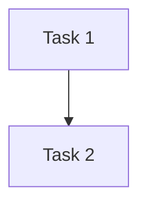

# Tasks

## Initiative
- Name:
- Folder:

## Wave Summary
| Wave | Goal | Tasks | Entry Criteria | Exit Criteria | Status |
| --- | --- | --- | --- | --- | --- |
| Wave 1 |  |  |  |  | Not Started |

## Dependency Graph

## Task List
| ID | Wave | Mode | Task | Owner Agent | Dependencies | Target Files Or Areas | Validation | Status |
| --- | --- | --- | --- | --- | --- | --- | --- | --- |
| T1 | 1 | [S] |  | developer |  |  |  | Not Started |

## Serial And Parallel Rules
- `[S]` means the task must be completed in dependency order.
- `[P]` means the task may run in parallel with other independent tasks in the same wave.

## Current Wave Notes
-
